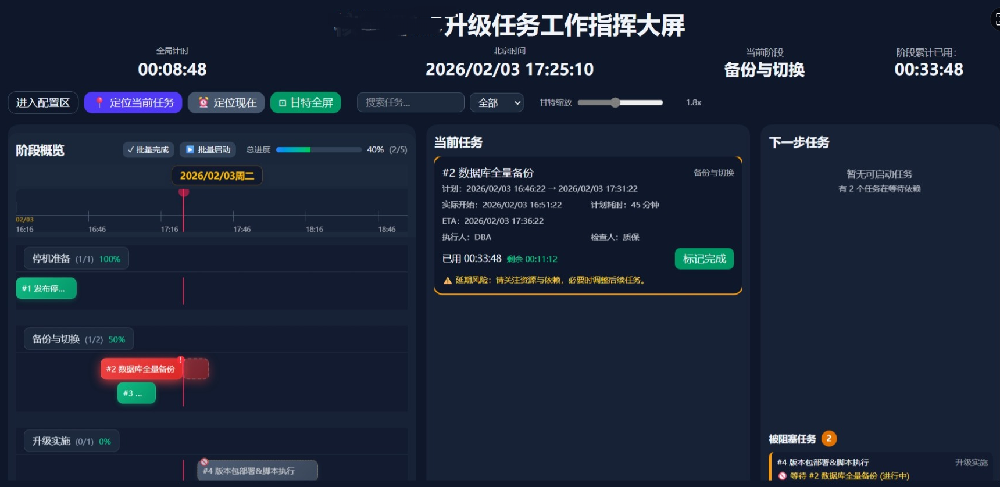
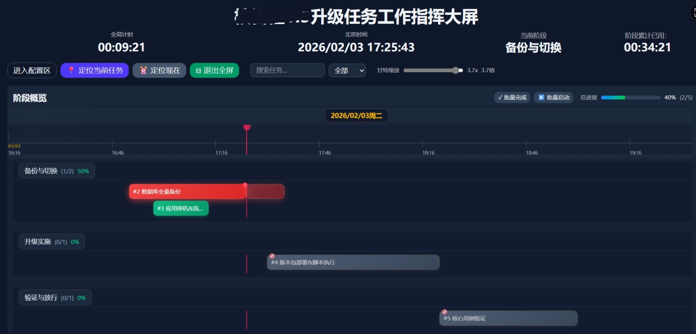
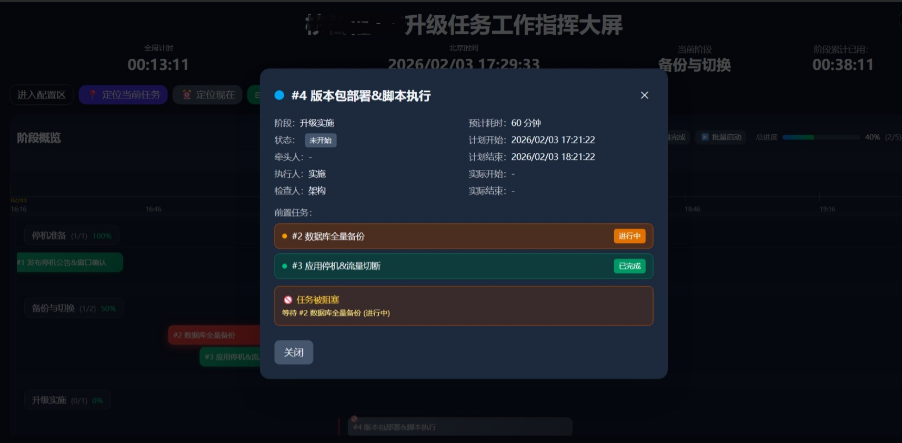
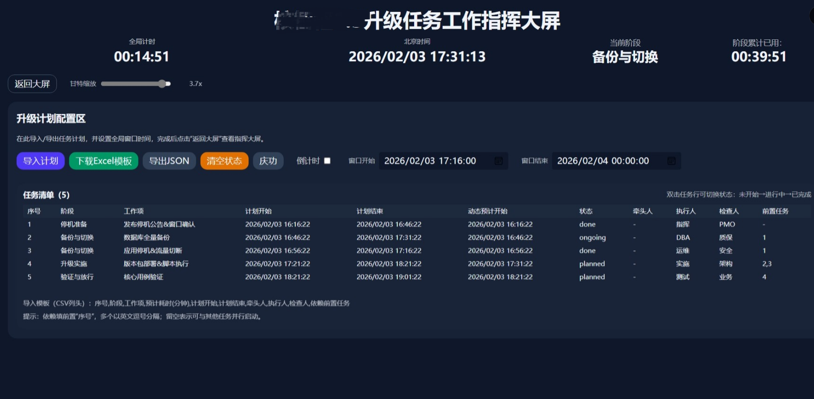

# 升级指挥大屏

实时系统升级任务指挥大屏，用于在升级、割接、迁移、发布等窗口期统一展示任务计划、依赖关系、执行进度和风险状态。项目采用 React + Vite 构建，支持 Excel/CSV/JSON 导入导出，适合在大屏、会议室或指挥中心浏览器中运行。

## 主要能力

- 甘特图总览：按阶段展示计划时间、实际开始/结束、当前时间线、延期风险和超时状态。
- 依赖管理：任务可配置前置依赖，未满足依赖时阻止启动并展示阻塞原因。
- 进度监控：展示总体进度、阶段进度、当前任务、下一步任务、即将开始提醒和操作记录。
- 数据导入导出：支持 Excel、CSV、JSON 导入，支持下载 Excel 模板，支持导出含实际执行数据的 Excel。
- 大屏操作：支持甘特图全屏、自适应缩放、定位当前任务、定位当前时间、批量启动/完成任务。
- 现场辅助：支持演示时间、庆功页、操作记录折叠、已完成任务超时效果开关。
- 本地持久化：任务、日志、窗口时间和开关项保存在浏览器 `localStorage`。

## 系统演示截图

### 大屏总览



### 配置与任务计划



### 甘特图与任务状态



### 全屏与现场展示



## 技术栈

- React 19
- Vite 7
- Tailwind CSS 4
- SheetJS `xlsx`
- ESLint 9

## 快速启动

```bash
npm install
npm run dev
```

构建生产包：

```bash
npm run build
```

构建完成后会生成 `dist/`，并通过脚本压缩为 `dist.zip`。生产部署时将 `dist/` 内文件发布到 Nginx 站点目录即可。

## 常用脚本

| 命令 | 说明 |
| --- | --- |
| `npm run dev` | 启动 Vite 开发服务 |
| `npm run build` | 构建生产包并生成 `dist.zip` |
| `npm run preview` | 本地预览生产构建 |
| `npm run lint` | 执行 ESLint 检查 |
| `npm run zip` | 单独压缩 `dist/` 为 `dist.zip` |

## 目录结构

```text
ioa-wall/
├── docs/                         # Markdown 说明文档
│   ├── PROJECT_STRUCTURE.md       # 文档目录与代码结构说明
│   ├── DEPLOYMENT.md              # Windows / 麒麟 Linux 部署说明
│   ├── CHANGELOG.md               # 更新记录
│   └── assets/screenshots/        # 系统演示截图
├── public/
│   ├── celebration-bg.png         # 庆功页背景图
│   └── vite.svg                   # Vite 默认静态资源
├── src/
│   ├── App.jsx                    # 主应用、任务调度、导入导出、甘特图和交互逻辑
│   ├── index.css                  # Tailwind 引入、全局滚动条和任务状态样式
│   ├── App.css                    # 甘特图相关补充样式
│   └── main.jsx                   # React 入口
├── index.html                     # Vite HTML 入口
├── package.json                   # 依赖与脚本
├── vite.config.js                 # Vite 配置
└── README.md                      # 项目入口说明
```

更详细的文档和代码结构见 [docs/PROJECT_STRUCTURE.md](docs/PROJECT_STRUCTURE.md)。

## 使用流程

1. 进入配置区。
2. 下载 Excel 模板。
3. 按模板维护任务计划、计划时间、责任人、检查人和依赖关系。
4. 导入 Excel、CSV 或 JSON 文件。
5. 配置升级窗口开始/结束时间和项目标题。
6. 返回大屏进行现场指挥。
7. 执行过程中启动任务、完成任务、查看阻塞原因和操作记录。
8. 升级结束后导出 Excel，留存计划与实际执行数据。

## 导入模板字段

| 字段 | 必填 | 说明 |
| --- | --- | --- |
| 序号 | 是 | 任务唯一 ID |
| 阶段 | 是 | 任务所属阶段 |
| 工作项 | 是 | 任务名称 |
| 预计耗时(分钟) | 是 | 预计执行时长 |
| 计划开始 | 是 | 支持 `YYYY-MM-DD HH:mm` 等常见格式 |
| 计划结束 | 否 | 为空时按计划开始 + 预计耗时计算 |
| 牵头人 | 否 | 牵头负责人 |
| 执行人 | 否 | 实际执行负责人 |
| 检查人 | 否 | 验证或复核负责人 |
| 依赖 | 否 | 前置任务 ID，多个任务用逗号分隔 |
| 状态 | 否 | 导入执行数据时可使用 |
| 实际开始 | 否 | 导入执行数据时可使用 |
| 实际结束 | 否 | 导入执行数据时可使用 |

## 部署文档

- [docs/DEPLOYMENT.md](docs/DEPLOYMENT.md)：Windows / 麒麟 Linux 的完整部署与更新说明。

## 更新记录

更新记录维护在 [docs/CHANGELOG.md](docs/CHANGELOG.md)。

## 浏览器建议

推荐使用 Chrome 或 Edge。大屏场景建议分辨率不低于 1920x1080。
